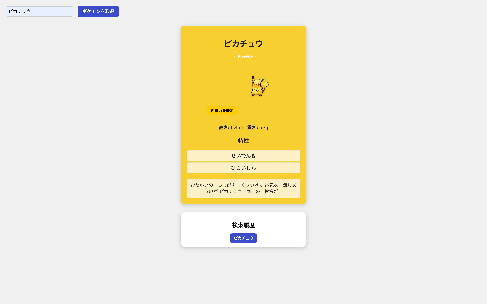

# 🚀 Async-Poke

---

## 📸 スクリーンショット(あれば)



---

## 📖 概要

HTML、CSS、JavaScript のみで構成されたポケモンを検索するツールです。
JavaScript の授業で非同期処理の学習の一環として作成しました。

---

## 📂 ファイル構成

```
├── index.html   // 検索ツールのメイン HTML ファイル。画面の土台や各種ボタン・表示領域を定義
├── style.css    // クイズ画面のスタイルシート。レイアウトや配色、レスポンシブ対応などを担当
└── script.js    // 主要ロジックを担当
                 // ・PokeAPIから全ポケモンデータ（日本語名・英語名）を取得・マッピング
                 // ・検索ボタンによるポケモン情報（画像・タイプ・説明・特性など）の取得・表示
                 // ・検索履歴（最大10件）の管理と再検索機能
                 // ・色違いポケモン画像の表示切り替え機能
                 // ・ポケモンタイプに応じた背景色・文字色の変更
                 // ・ランダム5%のキラキラ演出追加
                 // ・APIエラーハンドリング（入力エラー・通信エラー対応）
```

---

## 🛠 学習内容・技術スタック

- 使用した技術・学んだこと
  - HTML5 / CSS3 / JavaScript（ES6+）
  - PokeAPI の多言語対応方法
  - 非同期処理（async/await）の実装
  - エラーハンドリング
  - UI/UX の工夫
  - イベントハンドリング
  - 状態管理（色違い切替・履歴管理）

---

## 💡 こだわったポイント・工夫したところ

- **日本語 → 英語変換**
  通常の PokeAPI では英語名による検索のみ対応しているため、`pokemon-species` エンドポイントから全ポケモンデータを取得し、日本語名と英語名の対応マッピング処理を実装しました。これにより、日本語名での検索が可能になりました。

- **色違い切替の実装方法**
  ポケモン画像表示部分に「色違い切替ボタン」を追加し、クリックのたびに通常/色違いの画像を切り替える処理を実装しました。また、ボタンのテキストも「色違いを表示」「通常色を表示」と状態に応じて変更されるようにしました。

- **検索履歴の動的作成とイベント付与**
  検索履歴（最大 10 件）を動的に作成・更新し、履歴ボタンをクリックするとその名前で再検索できるよう、各ボタンにイベントリスナーを付与しました。履歴更新時にはすべての履歴ボタンのイベント付け直しを行うことで、常に最新の状態を保つよう工夫しました。

- **API 負荷を考慮した async/await の連続 fetch**
  全ポケモン（1000 体以上）の日本語名データを取得する必要があるため、非同期処理（`async/await`）を活用し、一件ずつ順番に fetch を行う形にしました。また、通信エラー発生時に備えて`try/catch`によるエラーハンドリングも実装し、API 負荷や予期しない停止への対策を行いました。

---

## 🔍 振り返り・今後の課題

- **できるようになったこと**
  ・API からデータを取得し画面に反映できた
  ・fetch を使って取得できた
  ・エラーハンドリングの実装ができた

- **課題**
  ・英語名・ID 検索対応
  ・表示ポケモン数を増やす（進化系表示など）

---

## 🎮 デモページ

実際に動作する検索ツールはこちらから体験できます。
[https://chisato410.github.io/Async-Poke/](https://chisato410.github.io/Async-Poke/)
